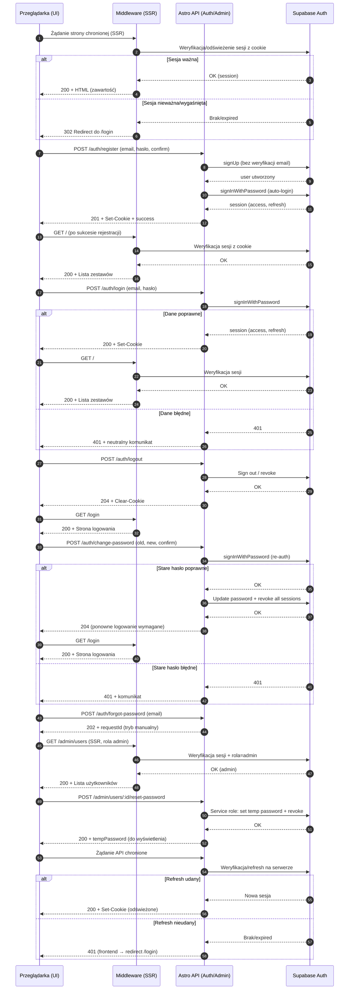

```mermaid
sequenceDiagram
autonumber
participant B as Przeglądarka (UI)
participant M as Middleware (SSR)
participant A as Astro API (Auth/Admin)
participant S as Supabase Auth

%% Ochrona tras
B->>M: Żądanie strony chronionej (SSR)
M->>S: Weryfikacja/odświeżenie sesji z cookie
alt Sesja ważna
  S-->>M: OK (session)
  M-->>B: 200 + HTML (zawartość)
else Sesja nieważna/wygaśnięta
  S-->>M: Brak/expired
  M-->>B: 302 Redirect do /login
end

%% Rejestracja (auto-logowanie)
B->>A: POST /auth/register (email, hasło, confirm)
A->>S: signUp (bez weryfikacji email)
S-->>A: user utworzony
A->>S: signInWithPassword (auto-login)
S-->>A: session (access, refresh)
A-->>B: 201 + Set-Cookie + success
B->>M: GET / (po sukcesie rejestracji)
M->>S: Weryfikacja sesji z cookie
S-->>M: OK
M-->>B: 200 + Lista zestawów

%% Logowanie
B->>A: POST /auth/login (email, hasło)
A->>S: signInWithPassword
alt Dane poprawne
  S-->>A: session (access, refresh)
  A-->>B: 200 + Set-Cookie
  B->>M: GET /
  M->>S: Weryfikacja sesji
  S-->>M: OK
  M-->>B: 200 + Lista zestawów
else Dane błędne
  S-->>A: 401
  A-->>B: 401 + neutralny komunikat
end

%% Wylogowanie
B->>A: POST /auth/logout
A->>S: Sign out / revoke
S-->>A: OK
A-->>B: 204 + Clear-Cookie
B->>M: GET /login
M-->>B: 200 + Strona logowania

%% Zmiana hasła (re-auth)
B->>A: POST /auth/change-password (old, new, confirm)
A->>S: signInWithPassword (re-auth)
alt Stare hasło poprawne
  S-->>A: OK
  A->>S: Update password + revoke all sessions
  S-->>A: OK
  A-->>B: 204 (ponowne logowanie wymagane)
  B->>M: GET /login
  M-->>B: 200 + Strona logowania
else Stare hasło błędne
  S-->>A: 401
  A-->>B: 401 + komunikat
end

%% Zapomniane hasło (MVP: manualny)
B->>A: POST /auth/forgot-password (email)
A-->>B: 202 + requestId (tryb manualny)

%% Admin: reset hasła
B->>M: GET /admin/users (SSR, rola admin)
M->>S: Weryfikacja sesji + rola=admin
S-->>M: OK (admin)
M-->>B: 200 + Lista użytkowników
B->>A: POST /admin/users/:id/reset-password
A->>S: Service role: set temp password + revoke
S-->>A: OK
A-->>B: 200 + tempPassword (do wyświetlenia)

%% Odświeżenie podczas użycia UI
B->>A: Żądanie API chronione
A->>S: Weryfikacja/refresh na serwerze
alt Refresh udany
  S-->>A: Nowa sesja
  A-->>B: 200 + Set-Cookie (odświeżone)
else Refresh nieudany
  S-->>A: Brak/expired
  A-->>B: 401 (frontend → redirect /login)
end

```
