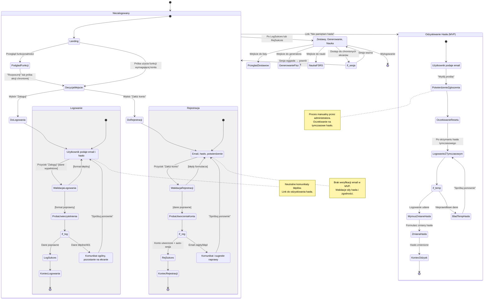

```mermaid
stateDiagram-v2

[*] --> Niezalogowany

state "Niezalogowany" as Niezalogowany {
  [*] --> Landing
  Landing --> PodgladFunkcji: Przegląd funkcjonalności
  PodgladFunkcji --> DecyzjaWejscie: "Rozpocznij" lub próba akcji chronionej
  Landing --> DecyzjaWejscie: Próba użycia funkcji wymagającej konta

  state DecyzjaWejscie <> 
  DecyzjaWejscie --> DoLogowania: Wybór "Zaloguj"
  DecyzjaWejscie --> DoRejestracji: Wybór "Załóż konto"

  DoLogowania --> FormularzLogowania
  DoRejestracji --> FormularzRejestracji

  state "Logowanie" as Logowanie {
    [*] --> FormularzLogowania
    FormularzLogowania: Użytkownik podaje email i hasło
    note right of FormularzLogowania
      Neutralne komunikaty błędów.
      Link do odzyskiwania hasła.
    end note

    FormularzLogowania --> WalidacjaLogowania: Przycisk "Zaloguj" [dane wypełnione]
    WalidacjaLogowania --> ProbaUwierzytelnienia: [format poprawny]
    WalidacjaLogowania --> FormularzLogowania: [format błędny]

    state if_log <> 
    ProbaUwierzytelnienia --> if_log
    if_log --> LogSukces: Dane poprawne
    if_log --> LogBlad: Dane błędne/401

    LogBlad: Komunikat ogólny, pozostanie na ekranie
    LogSukces --> KoniecLogowania

    LogBlad --> FormularzLogowania: "Spróbuj ponownie"
    KoniecLogowania --> [*]
  }

  state "Rejestracja" as Rejestracja {
    [*] --> FormularzRejestracji
    FormularzRejestracji: Email, hasło, potwierdzenie
    note right of FormularzRejestracji
      Brak weryfikacji email w MVP.
      Walidacje siły hasła i zgodności.
    end note

    FormularzRejestracji --> WalidacjaRejestracji: Przycisk "Załóż konto"
    WalidacjaRejestracji --> ProbaUtworzeniaKonta: [dane poprawne]
    WalidacjaRejestracji --> FormularzRejestracji: [błędy formularza]

    state if_reg <> 
    ProbaUtworzeniaKonta --> if_reg
    if_reg --> RejSukces: Konto utworzone + auto-sesja
    if_reg --> RejBlad: Email zajęty/błąd

    RejBlad: Komunikat i sugestie naprawy
    RejSukces --> KoniecRejestracji

    RejBlad --> FormularzRejestracji: "Spróbuj ponownie"
    KoniecRejestracji --> [*]
  }
}

Niezalogowany --> AplikacjaGlowna: Po LogSukces lub RejSukces
AplikacjaGlowna: Zestawy, Generowanie, Nauka

state "Odzyskiwanie Hasła (MVP)" as Odzysk {
  [*] --> FormularzOdzysk
  FormularzOdzysk: Użytkownik podaje email
  FormularzOdzysk --> PotwierdzenieZgloszenia: "Wyślij prośbę"
  note right of PotwierdzenieZgloszenia
    Proces manualny przez administratora.
    Oczekiwanie na tymczasowe hasło.
  end note

  PotwierdzenieZgloszenia --> OczekiwanieResetu
  OczekiwanieResetu --> LogowanieZTymczasowym: Po otrzymaniu hasła tymczasowego

  state if_temp <> 
  LogowanieZTymczasowym --> if_temp
  if_temp --> WymusZmianeHasla: Logowanie udane
  if_temp --> BladTempHasla: Nieprawidłowe dane

  BladTempHasla --> LogowanieZTymczasowym: "Spróbuj ponownie"
  WymusZmianeHasla --> ZmianaHasla: Formularz zmiany hasła
  ZmianaHasla --> KoniecOdzysk: Hasło zmienione
  KoniecOdzysk --> [*]
}

%% Nawigacja do modułu odzyskiwania
Niezalogowany --> Odzysk: Link "Nie pamiętam hasła"

%% Stany aplikacji po wejściu
AplikacjaGlowna --> PrzegladZestawow: Wejście do listy
AplikacjaGlowna --> GenerowanieFisz: Wejście do generatora
AplikacjaGlowna --> NaukaFSRS: Wejście do nauki

%% Ochrona tras – wygaśnięcie sesji
state if_sesja <> 
AplikacjaGlowna --> if_sesja: Dostęp do chronionych ekranów
if_sesja --> AplikacjaGlowna: Sesja ważna
if_sesja --> Niezalogowany: Sesja wygasła → powrót do Logowania

%% Wyjście
AplikacjaGlowna --> [*]: Wylogowanie
```