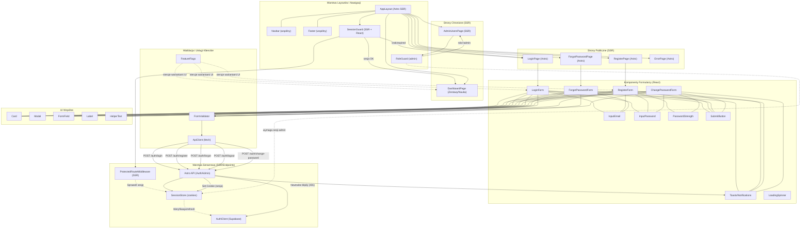

```mermaid
flowchart TD

%% Kierunek główny: top-down dla hierarchii, poziomy dla przepływów procesów

%% Subgraf: Layout i nawigacja
subgraph Layouts["Warstwa Layoutów i Nawigacji"]
  AppLayout["AppLayout (Astro SSR)"]
  Navbar["Navbar (wspólny)"]
  Footer["Footer (wspólny)"]
  SessionGuard["SessionGuard (SSR + React)"]
  RoleGuard["RoleGuard (admin)"]
end

AppLayout --- Navbar
AppLayout --- Footer
AppLayout --> SessionGuard

%% Subgraf: Strony publiczne (SSR)
subgraph Public["Strony Publiczne (SSR)"]
  LoginPage["LoginPage (Astro)"]
  RegisterPage["RegisterPage (Astro)"]
  ForgotPasswordPage["ForgotPasswordPage (Astro)"]
  ErrorPage["ErrorPage (Astro)"]
end

%% Subgraf: Strony chronione (SSR)
subgraph Protected["Strony Chronione (SSR)"]
  DashboardPage["DashboardPage (Zestawy/Nauka)"]
  AdminUsersPage["AdminUsersPage (SSR)"]
end

%% Subgraf: Komponenty formularzy (React Islands)
subgraph Forms["Komponenty Formularzy (React)"]
  LoginForm["LoginForm"]
  RegisterForm["RegisterForm"]
  ForgotPasswordForm["ForgotPasswordForm"]
  ChangePasswordForm["ChangePasswordForm"]
  InputEmail["InputEmail"]
  InputPassword["InputPassword"]
  PasswordStrength["PasswordStrength"]
  SubmitButton["SubmitButton"]
  Toasts["Toasts/Notifications"]
  LoadingSpinner["LoadingSpinner"]
end

%% Subgraf: Walidacja i usługi klienckie
subgraph ClientServices["Walidacja i Usługi Klienckie"]
  FormValidator["FormValidator"]
  ApiClient["ApiClient (fetch)"]
  FeatureFlags["FeatureFlags"]
end

%% Subgraf: Warstwa serwerowa/SSR
subgraph ServerSide["Warstwa Serwerowa (SSR/Endpoints)"]
  ProtectedRouteMiddleware["ProtectedRouteMiddleware (SSR)"]
  AstroAPI["Astro API (Auth/Admin)"]
  SessionStore["SessionStore (cookies)"]
  AuthClient["AuthClient (Supabase)"]
end

%% Subgraf: UI wspólne
subgraph SharedUI["UI Wspólne"]
  Card["Card"]
  Modal["Modal"]
  FormField["FormField"]
  Label["Label"]
  HelperText["HelperText"]
end

%% Połączenia między warstwami
%% Nawigacja i ochrona tras
SessionGuard --> ProtectedRouteMiddleware
ProtectedRouteMiddleware -.Sprawdź sesję.-> SessionStore
SessionStore -.Weryfikacja/refresh.-> AuthClient

%% Routing publiczny
LoginPage --> LoginForm
RegisterPage --> RegisterForm
ForgotPasswordPage --> ForgotPasswordForm

%% Formularze -> UI wspólne
LoginForm --- Card
LoginForm --- FormField
LoginForm --- InputEmail
LoginForm --- InputPassword
LoginForm --- SubmitButton
LoginForm --- HelperText
LoginForm --- Toasts

RegisterForm --- Card
RegisterForm --- FormField
RegisterForm --- InputEmail
RegisterForm --- InputPassword
RegisterForm --- PasswordStrength
RegisterForm --- SubmitButton
RegisterForm --- HelperText
RegisterForm --- Toasts

ForgotPasswordForm --- Card
ForgotPasswordForm --- FormField
ForgotPasswordForm --- InputEmail
ForgotPasswordForm --- SubmitButton
ForgotPasswordForm --- HelperText
ForgotPasswordForm --- Toasts

ChangePasswordForm --- Card
ChangePasswordForm --- FormField
ChangePasswordForm --- InputPassword
ChangePasswordForm --- PasswordStrength
ChangePasswordForm --- SubmitButton
ChangePasswordForm --- HelperText
ChangePasswordForm --- Toasts

%% Formularze -> Walidacja/Serwisy
LoginForm --> FormValidator
RegisterForm --> FormValidator
ForgotPasswordForm --> FormValidator
ChangePasswordForm --> FormValidator

FormValidator --> ApiClient

%% Klient -> Serwer
ApiClient -- "POST /auth/login" --> AstroAPI
ApiClient -- "POST /auth/register" --> AstroAPI
ApiClient -- "POST /auth/forgot" --> AstroAPI
ApiClient -- "POST /auth/logout" --> AstroAPI
ApiClient -- "POST /auth/change-password" --> AstroAPI

%% Serwer -> Auth/Sesja
AstroAPI --> AuthClient
AstroAPI --> SessionStore

%% Przepływy sukcesu i błędów
AstroAPI -- "Set-Cookie (sesja)" --> SessionStore
AstroAPI -- "Neutralne błędy (401)" --> Toasts

%% Dostęp do stron chronionych
SessionGuard -- "sesja OK" --> DashboardPage
RoleGuard -- "rola=admin" --> AdminUsersPage
SessionGuard -- "brak/expired" --> LoginPage

%% Layout osadza strony
AppLayout --> LoginPage
AppLayout --> RegisterPage
AppLayout --> ForgotPasswordPage
AppLayout --> DashboardPage
AppLayout --> AdminUsersPage
AppLayout --> ErrorPage

%% Zależności i aktualizacje
FeatureFlags -.steruje wariantami UI.-> LoginForm
FeatureFlags -.steruje wariantami UI.-> RegisterForm
FeatureFlags -.steruje wariantami UI.-> DashboardPage

%% Admin SSR ochrona
AdminUsersPage --> RoleGuard
RoleGuard -.wymaga sesji admin.-> SessionStore

```